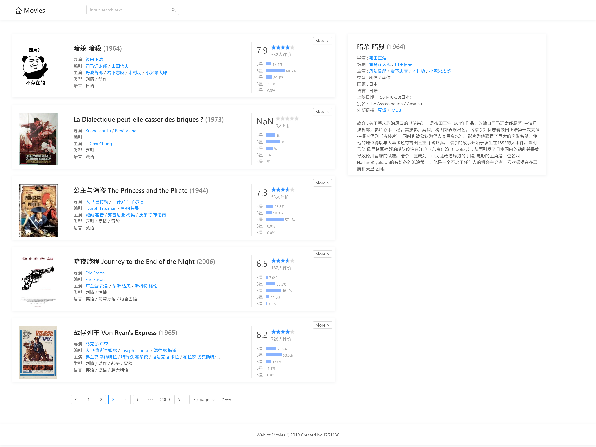
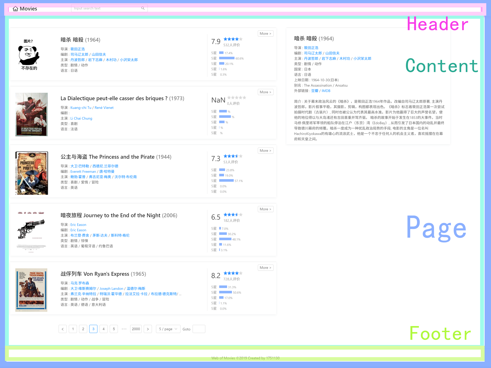
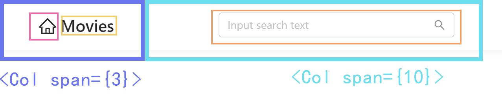
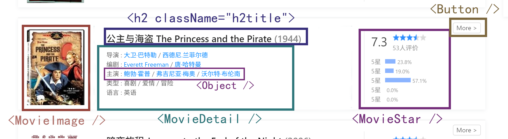
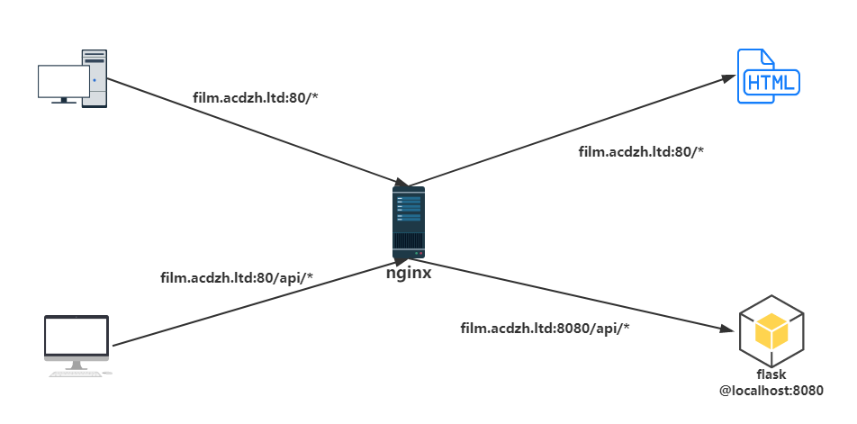

# Web 第三次作业
朱宽 1751130

     

[TOC]

___

## 项目简介

### 项目地址: [http://film.acdzh.ltd/](http://film.acdzh.ltd/)

### 已实现:

1. 基本数据的浏览, 访问
2. 电影详情页 (浮动页面形式)
3. 电影信息关键字搜索 (搜索标题/年份/导演/演员/语言/类型/国家/...)

### 待实现:

1. 前端路由
1. 移动端界面优化
1. 后端服务安全性改进

### 系统截图:



___

## 系统架构

* **服务器:** &nbsp; `Ubuntu 18.04 LTS`
* **前端:** &nbsp; `React.js v16.8.6` + `Antd v3.18.1`
* **后端:** &nbsp; `nginx v1.14.0` + `flask v1.0.2` + `python 3.6.5` + `mySQL v8.0.16`


### 前端架构

整个 `<Page />` 由 `<MyHeader />`, `<MyContent >`, `<Footer />` 组成:


#### MyHeader



#### MyContent




### 后端架构

当请求地址为根目录时, nginx 作为静态文件服务器. 当请求地址为 `/api` 时, nginx 作为反向代理服务器, 将请求代理至 8080 端口的 api 接口上.



有两个 api 接口:

1. 请求列表交接口
    地址示例: `film.acdzh.ltd/api/list?begin=0&end=5`
    返回一个 json 数组, 包含范围内的电影项

2. 搜索接口
    地址示例: `film.acdzh.ltd/api/search?key=英语`
    返回一个搜索结果的 json 数组 

___

## 项目构建

> 此文件夹位于目录 `/root` 下

### mySQL, flask 初始化

在命令行下执行:

```sh
sudo apt-get install mysql-server mysql-client
sudo apt-get install python3 python3-pip
pip3 install flask pymysql
```

连接数据库, 更改初始密码. 之后新建数据表:

```sql
create database movies;
use movies;
create table movie (id int primary key, info json);
exit;
```

根据自己之前设定的数据库用户名及密码更新 `/init_mysql/init_mysql.py` 中的第七行.

执行命令 `python3 /init_mysql/init_mysql.py` , 完成数据库初始化.

### 前端构建

> 前端脚手架构建依赖 `Node.js v10.15.0` 和 `yarn v1.15.2`

执行以下命令, 完成构建: 

```sh
cd front-end/film
yarn install
yarn build
```

### nginx 部署

> 服务端部署在 `root` 用户下, 项目文件放置于目录 `/root/website` 中

root用户下执行:

```sh
cd /root
mkdir website
cp /root/src/front-end/film/build/* /root/website
cp /root/src/main.py /root/website
cd website
```
配置 nginx:

```sh
apt-get install nginx
start nginx
vim /etc/nginx/nginx.conf
```

将第一行 `user www-data` 改为 `user root`;

之后: 

```sh
vim /etc/nginx/sites-enables/film.conf
```

写入以下内容:

```sh
server {
    listen 80;
    server_name film.acdzh.ltd;
    location / {
        root /root/website;
        index index.html;
    }
    location /api/ {
        proxy_pass http://film.acdzh.ltd:8080;
        proxy_set_header Host $host:$server_port;
        proxy_redirect / /api/;
    }
}
```

重启 nginx 服务: `services nginx restart`

现在已经做好了静态文件服务, 以及 api 后端代理, 下一步只需要启动后端 api 服务了.

### 后端服务部署

根据自己之前设定的数据库用户名及密码更新 `/root/website/main.py` 中的第 16 行和第 32 行.

```
cd /root/website
nohup python3 main.py > flask.log 2>&1&
exit
```

至此所有服务配置完成, 打开[链接](http://film.acdzh.ltd/)就可以直接访问了.

